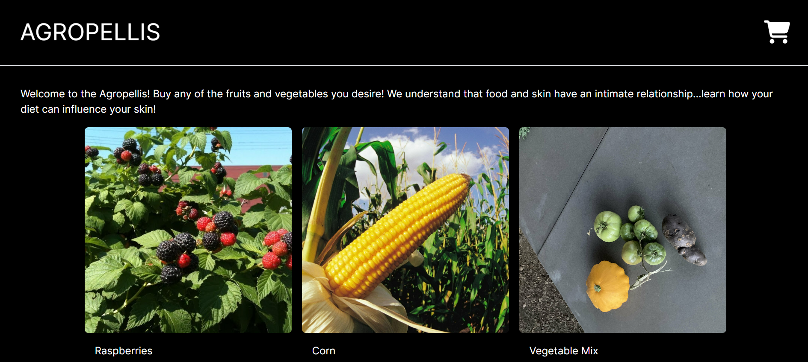
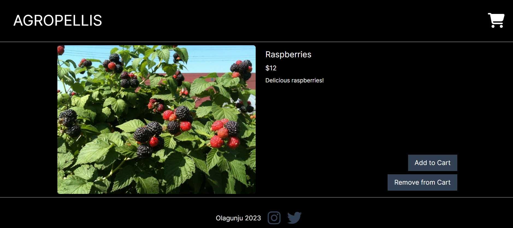

# Welcome to my Ecommerce site!

## 💡 Motivation 

I was interested in building an ecommerce site. I went with building the frontend with Chakra UI and Next.js. I also wanted to start learning about state, so I chose to integrate it with zustand. I learned a lot about persisting state with local storage, using dynamic imports to avoid server side rendering, and managing state with zustand! Shout out to [SmolJames](https://www.youtube.com/@Smoljames/videos) for the awesome tutorial!

Feel free to [reach out](https://abneuro.vercel.app/contact) to me if you have any additional questions. There are lots of features that still need to be implemented!

## ✨ Pages 

1. **Home Page**: <br/>
 

2. **Product Page**: <br/>
 

## ⚡️ Technologies 

This site was built using Next.js and Chakra UI in the frontend. 

I stored the products on Stripe, and managed state with Zustand.

**Why Zustand?**

Vercel make it really easy to deploy a website for free. In addition, I love the routing system and SEO benefits that Next.js offers. Next.js also makes it easy to work with API's!

The next time I do another project, I'm definitely looking forward to using TypeScript with Next.js!

### API Routes
- /api/checkout/route for posting request to Stripe

### Important Libraries
- zustand

### Future Improvements
1. User authentication and placing orders in somewhere safer than local storage.

## 👏 Contribute 

Contributions are welcome as always. Before submitting a new pull request, please make sure to open a new issue.

## Getting Started

First, run the development server:

```bash
npm run dev
# or
yarn dev
# or
pnpm dev
```

Open [http://localhost:3000](http://localhost:3000) with your browser to see the result.

## Deploy on Vercel

The easiest way to deploy your Next.js app is to use the [Vercel Platform](https://vercel.com/new?utm_medium=default-template&filter=next.js&utm_source=create-next-app&utm_campaign=create-next-app-readme) from the creators of Next.js.

Check out the [Next.js deployment documentation](https://nextjs.org/docs/deployment) for more details.
